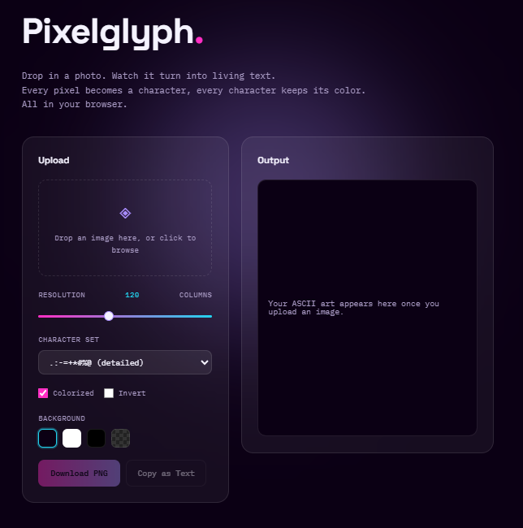
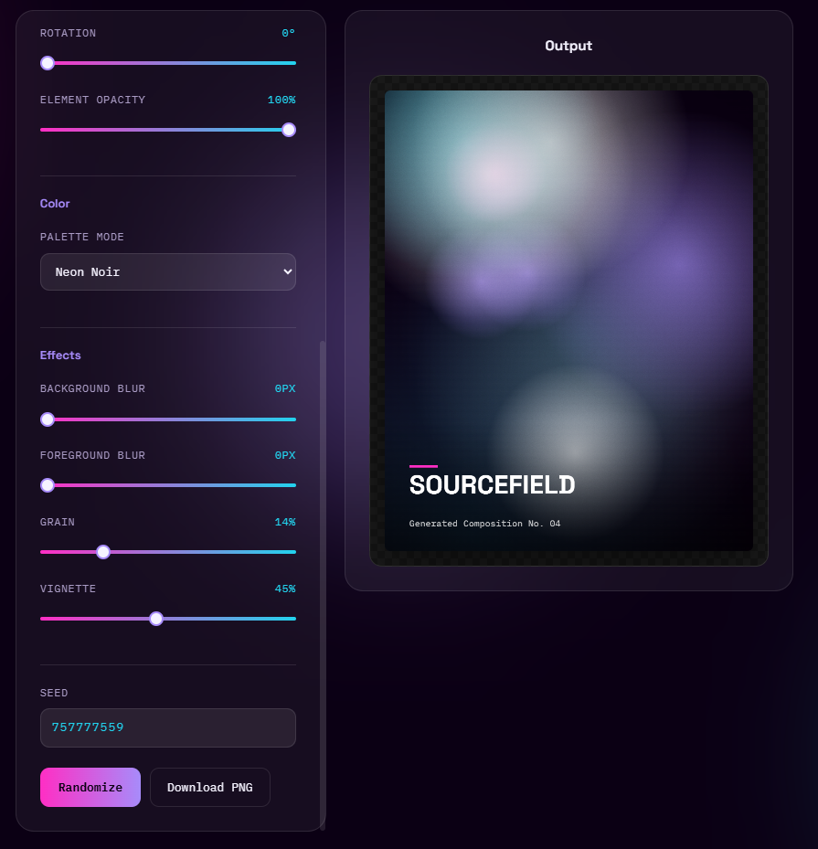

# ⬢ Sourcefield · Generative Poster Maker

A poster generator with full manual control. Every color, blur, density, and size is
yours to set, generation just gives you a starting point.

**[Live Demo →](https://whyonlythakur.github.io/Sourcefield/)** 

<p align="center">
  
  
</p>

---

## Why I built this

Part of the same visual-lab series as [Pixelglyph](https://github.com/whyonlythakur/Pixelglyph).
The first version of this leaned entirely on randomness, hit generate and hope. This
version flips that: randomness only decides where shapes land and, in Procedural color
mode, a starting hue. Everything else, colors, blur, density, line weight, rotation,
opacity, grain, vignette, is a direct control you set and keep, tweaking a slider never
re-randomizes the composition underneath it.

## Features

**Composition**
- **6 generative styles**: Flow Field (seeded value-noise particle tracing), Fractal
  Circles (recursive circle-packing), Blobs, Grid Dots, Stripes, Rings
- **Density**, **Element Size**, **Line Width**, **Rotation**, and **Opacity** sliders,
  every style responds to all five

**Color**
- **Procedural mode**: generates a fresh palette from a random base hue using real
  color-harmony rules (complementary, analogous, triadic, split-complementary)
- **5 curated presets**
- **Custom mode**: 5 direct color pickers (background + 4 accents), full manual palette
  control, no randomness involved at all

**Effects**
- **Background Blur** and **Foreground Blur**, independent, applied via real canvas
  compositing (each layer is rendered separately, then blurred and composited)
- **Grain** and **Vignette** intensity sliders

**Export**
- **Seeded**: every composition shows its seed, "Randomize" picks a new one, every
  other control stays fixed on re-render
- **Download as full-resolution PNG**
- **Zero dependencies**: vanilla HTML/CSS/JS, no framework, no build step

## How it works

- **Flow Field** uses a custom seeded value-noise implementation to drive particle
  trajectories, each particle follows the local noise angle for 140 steps
- **Fractal Circles** recursively subdivides: every circle spawns 2 to 4 child circles
  until it hits the depth limit or a minimum size
- **Background and foreground are rendered to separate offscreen canvases**, then
  composited onto the final canvas with independent CSS-filter blur amounts, so blurring
  the background never touches the sharpness of the foreground pattern, or vice versa
- **Procedural palettes** pick a random base hue, then apply one of four color-harmony
  rules to generate the rest of the palette mathematically via HSL
- Every random decision pulls from one seeded [mulberry32](https://github.com/bryc/code/blob/master/jshash/PRNGs.md)
  PRNG stream, so a given seed with the same manual settings always reproduces
  pixel-identical output

## Tech stack

- HTML / CSS / vanilla JavaScript
- Canvas 2D API, including `ctx.filter` for real per-layer blur compositing
- Custom mulberry32 PRNG and value-noise implementations, no external libraries

## Run it locally

No build step needed, it's static files.

```bash
git clone https://github.com/whyonlythakur/poster-maker.git
cd poster-maker
# open index.html directly, or serve it:
python3 -m http.server 8000
# visit http://localhost:8000
```


## Roadmap / ideas for later

- [ ] Shareable URL that encodes the seed and every control value
- [ ] Save/load control presets
- [ ] Per-layer color overrides (background palette independent from foreground palette)

---

Built by Arpit Singh, part of an ongoing visual-lab series exploring generative
and image-based art in the browser.

Portfolio: [WhyOnlyThakur](https://thakur.snapz.dev)
